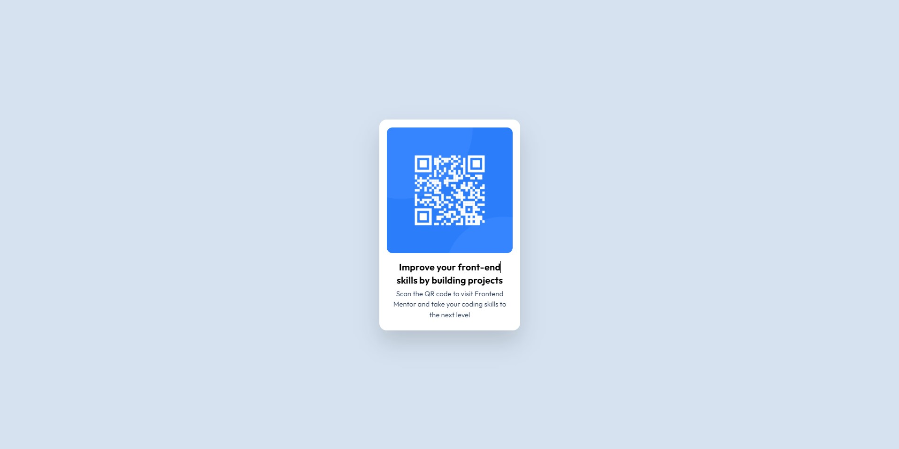

# Frontend Mentor - QR code component solution

This is a solution to the [QR code component challenge on Frontend Mentor](https://www.frontendmentor.io/challenges/qr-code-component-iux_sIO_H). Frontend Mentor challenges help you improve your coding skills by building realistic projects.

## Table of contents

- [Overview](#overview)
  - [Screenshot](#screenshot)
  - [Links](#links)
- [My process](#my-process)
  - [Built with](#built-with)
  - [What I learned](#what-i-learned)
  - [Continued development](#continued-development)
  - [Useful resources](#useful-resources)
- [Author](#author)

## Overview

### Screenshot

### Links

- Solution URL: [https://github.com/jmadilia/qr-code-component](https://github.com/jmadilia/qr-code-component)
- Live Site URL: [QR Code Component Solution using Tailwind CSS](https://jmadilia.github.io/qr-code-component/)

## My process

### Built with

- HTML
- Tailwind CSS

### What I learned

Proper setup of Tailwind (initializing config file, setting up script for build with PostCSS, dependencies, etc.).

### Continued development

- I did not quite get the [Prettier plugin](https://tailwindcss.com/docs/editor-setup#automatic-class-sorting-with-prettier) to work correctly. It would certainly help for slightly easier readability on long class names that have many utilities applied to them.
- More organized file structure.
- I could not get the paragraph padding <i>just</i> right how I wanted it to be. Practice makes perfect! :grin:

### Useful resources

The Tailwind official documentation is loaded with helpful examples, including code snippets and screenshots. Specifically, the [Editor Setup](https://tailwindcss.com/docs/editor-setup) was most helpful for a smooth VS Code experience.

## Author

- Frontend Mentor - [@jmadilia](https://www.frontendmentor.io/profile/jmadilia)
